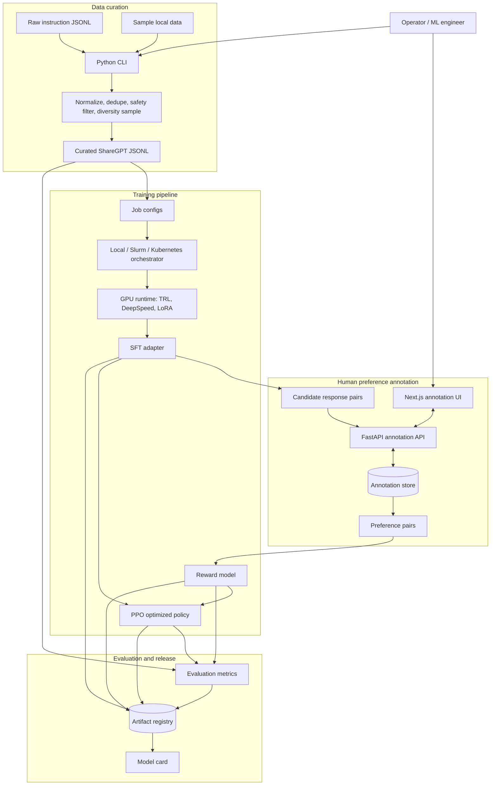

# Architecture

## System Design Diagram

The core boundary is between product logic and provider-specific execution. Local mode uses deterministic Python modules, SQLite, and dry-run training contracts. GPU mode binds the same data contracts and configs to TRL, DeepSpeed, W&B, S3, and a production database.

## Product Flow

1. Raw instruction data enters the curation pipeline.
2. Curation normalizes records to ShareGPT, removes malformed examples, near-deduplicates, filters unsafe content, and applies tempered diversity sampling.
3. SFT trains a LoRA adapter over the base model with response-only loss masking.
4. Annotators label side-by-side response pairs in the annotation platform.
5. Reward training fits a scalar-head model using Bradley-Terry preference loss.
6. PPO optimizes the SFT policy against the frozen reward model while an adaptive KL controller constrains drift from the reference policy.
7. Evaluation tracks benchmark quality, reward hacking indicators, response diversity, length/position bias, and human A/B results.
8. Release artifacts are registered with metadata, metrics, provenance, and a model card.

## Local vs GPU Execution

Local mode validates data contracts and product logic without large dependencies. GPU mode should bind the same configs into Hugging Face TRL, DeepSpeed, W&B, and S3.

The code intentionally separates pure functions from provider-specific integrations. That keeps tests fast and makes expensive training failures less likely to be caused by schema drift or malformed data.

## Annotation Data Model

The annotation store persists:

- `annotation_tasks`: prompt, response A, response B, metadata.
- `annotation_events`: annotator, choice (`a`, `b`, `tie`, `skip`), time taken, timestamp.

The queue avoids serving a task to the same annotator twice. The PRD's 10 percent overlap policy can be implemented by seeding duplicate task assignments through task metadata or a richer scheduler.
